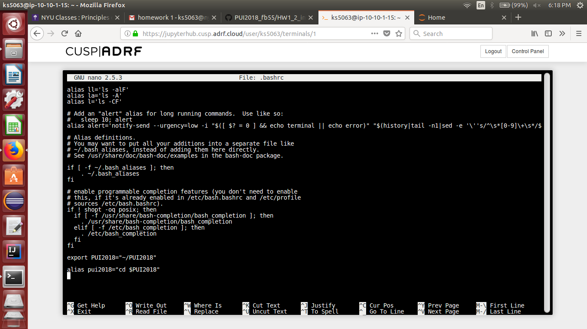
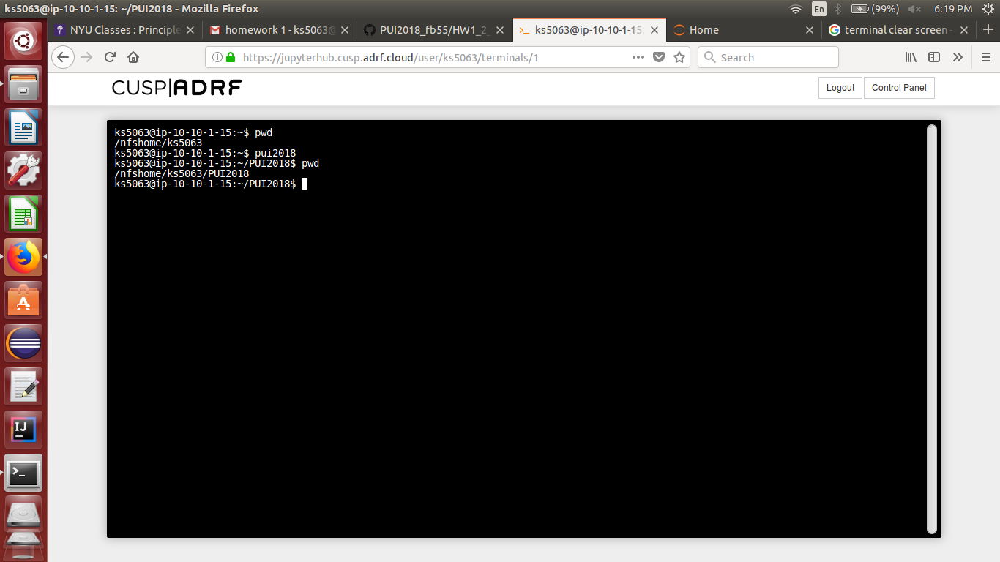

# Folder for HW1 submission

## Setting environment variables
- Edit the .bashrc file in windows
- At the very end of the file write export VARNAME="path to folder"
- Add an alias by writing alias varname="command $VARNAME"
- source .bashrc to get changes on the terminal

## Screenshot 1

## Screenshot 2

