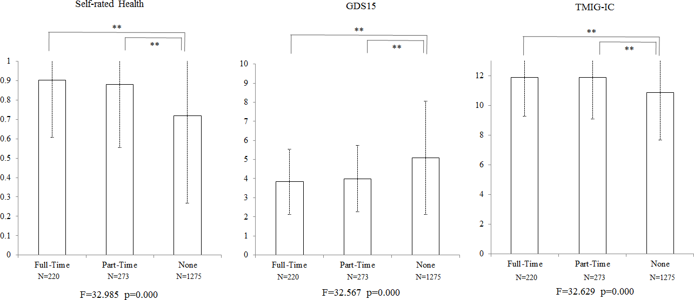
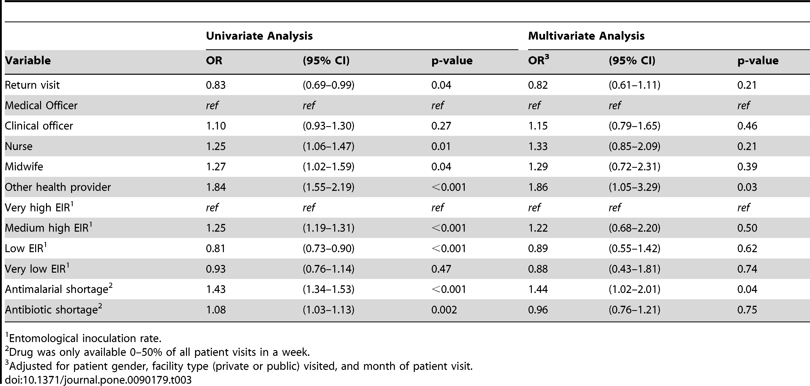
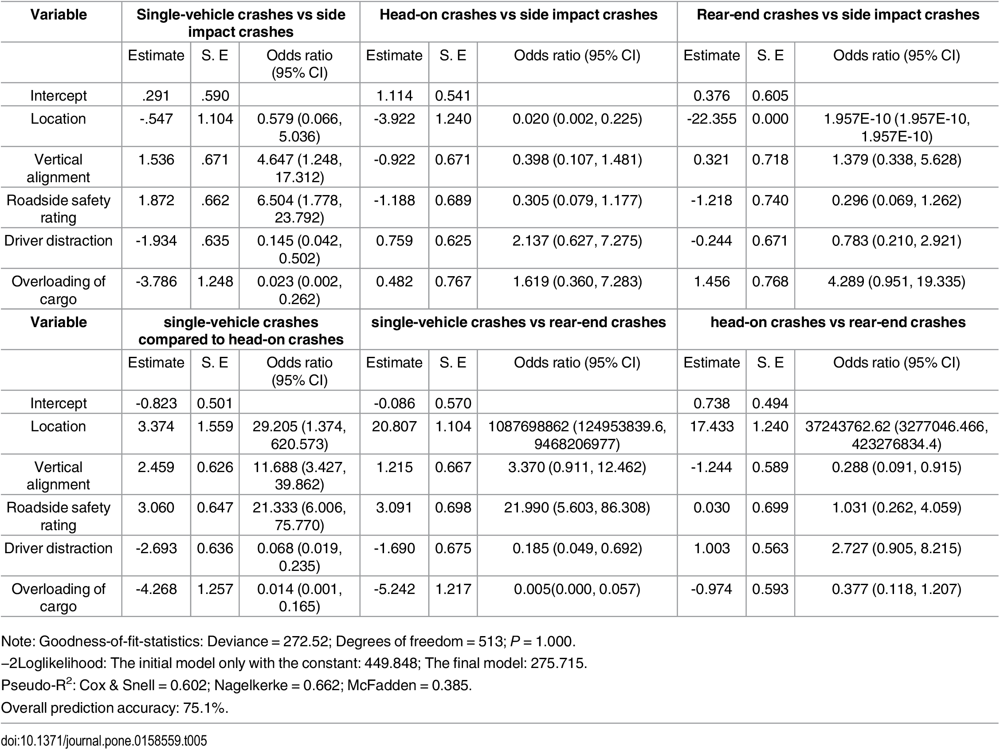

# Assignment 1

Markdown file for Citi Bike data was created for kp2393.

# Assignment 2

* Contributing members : ks5063 and ss12513
    * ks5063 : ANCOVA and Correlation
    * ss12513 : Logistic Regression

| **Statistical Analyses**	|  **IV(s)**  |  **IV type(s)** |  **DV(s)**  |  **DV type(s)**  |  **Control Var** | **Control Var type**  | **Question to be answered** | **_H0_** | **alpha** | **link to paper**| 
|:----------:|:----------|:------------|:-------------|:-------------|:------------|:------------- |:------------------|:----:|:-------:|:-------|
ANCOVA	| 2, Mental Health, HLFC | ordinal, ordinal | 1, working full-time or no| categorical | 5, sex, age, years of schooling, annual couple income, occupation (self-employed or not) | categorical, discrete numerical, discrete numerical, discrete numerical, categorical | 	Do participants in full-time status have mental health significantly higher than control group | Mental Health test groups <= Mental Health control group, HLFC test groups <= HLFC control group | 0.05 | [Effects of the Change in Working Status on the Health of Older People in Japan](https://journals.plos.org/plosone/article?id=10.1371/journal.pone.0144069) |
 Correlation	| 1, Instances of malaria | continuous | 1,  Inappropriate Prescribing of Antibiotics or no| categorical | 3, facility type (private or public), patient gender, visit month  | categorical, categorical, discrete numerical | 	Do facilities with higher Inappropriate Prescribing of Antibiotics have malaria cases significantly higher than control group | Malaria Cases test groups <= Malaria Cases control group | 0.05 | [Correlates of Inappropriate Prescribing of Antibiotics to Patients with Malaria in Uganda](https://journals.plos.org/plosone/article?id=10.1371/journal.pone.0090179) |
 Logistic Regression	| 1, Type of Crash | nominal | 5,  Location, Vertical Alignment, Road Side safety rating, Driver distraction, Overloading of Cargo| binary, binary, binary, binary, binary | 0  | NA | 	Do high fatalty car crashes with certain attributes have a higher chance of belonging to a certain crash type than crashes with different attributes  | P(Crash_Test) <= P(Crash_Control)  | 0.05 | [Differences in Factors Affecting Various Crash Types with High Numbers of Fatalities and Injuries in China](https://journals.plos.org/plosone/article?id=10.1371/journal.pone.0158559) |

## Results

## Effects of the Change in Working Status on the Health of Older People in Japan

## Correlates of Inappropriate Prescribing of Antibiotics to Patients with Malaria in Uganda

## Differences in Factors Affecting Various Crash Types with High Numbers of Fatalities and Injuries in China

# Assignment 3

* Contributing members : ks5063 and ss12513
    * ks5063 : Z test
    * ss12513 : Chi Square test
    
# Assignment 4

* Contributing members : ks5063 and ss12513
    * ks5063 : Both KS test and Data Transformations for Age and Boroughs.
    * ss12513 : Spearman and Pearson Correlation and Data Transformations for Trip Duration and Time.    

    
    
