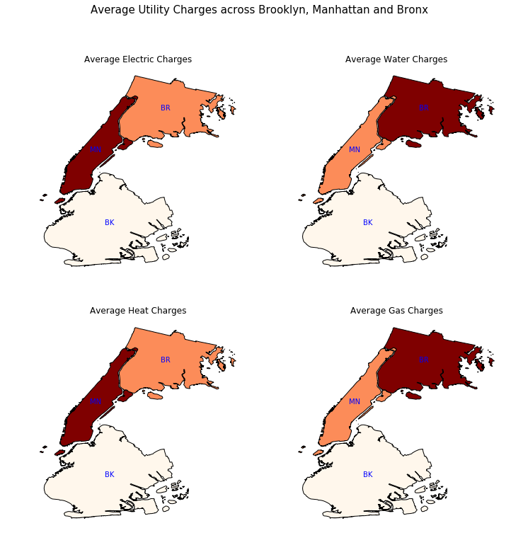

# Homework 8 submissions

## Assignment 1

* The following image was created using Housing Authority Data.
* Average Utility costs including Electricity, Water, Heat and Gas were calculated for Brooklyn, Manhattan and Bronx.
* Script is in the file "Assignment1.ipynb".
 

#### Figure 1 : Average Utility Charges across Brooklyn, Manhattan and Bronx. Brooklyn seems to have the least utility charges. Manhattan and Bronx are alternatively highest among different utilities.

## Assignment 2

* Done in collaboration with Saloni Saini (ss12513).
* Authorea Article : https://www.authorea.com/users/249374/articles/335449-title
